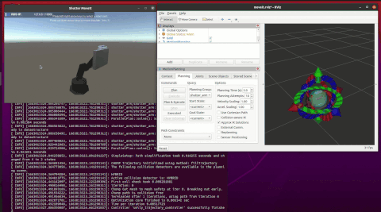
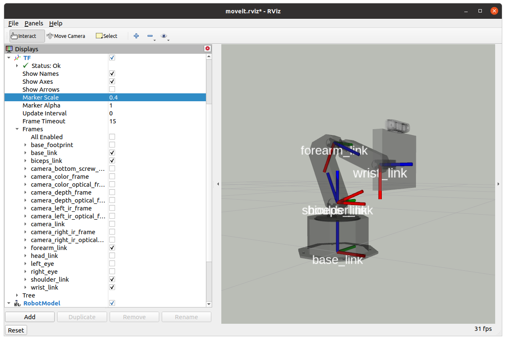
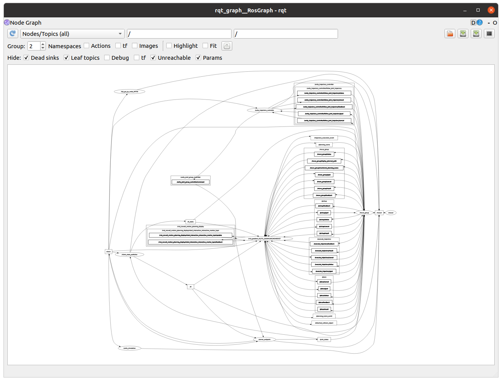

# Setting up your ROS Workspace

## Part 0 - Install dependencies

In a terminal, run the following commands to install general system dependencies for Shutter's code:

```
$ sudo apt install python3-vcstool
$ sudo apt install python-is-python3
```

> If you are setting up your workspace in the BIM laptops that are provided for the couse, then all apt dependencies have already been installed for you. If you encounter any problem about this, please contact the course T.F.

Then, install Python dependencies:

```
$ pip install --upgrade --user pip  # upgrade pip
$ pip install --user gdown          # install library to download Shutter simulation
```

When running commands on a terminal, pay attention to the information that is printed in the terminal. If you see any errors,
please post them in Slack and/or communicate with the course T.F.

## Part I - Set up your workspace to work with Shutter

*Catkin* is the official build system for ROS. To understand what it is for and why it exists, 
read sections 1, 2 and 4 of Catkin's conceptual overview document: 
[http://wiki.ros.org/catkin/conceptual_overview](http://wiki.ros.org/catkin/conceptual_overview).

Set up your Catkin workspace to work with the Shutter robot:

1. Create a [workspace](http://wiki.ros.org/catkin/workspaces) called *catkin_ws* 
in your home directory. Follow the steps in this tutorial: 
[http://wiki.ros.org/catkin/Tutorials/create_a_workspace](http://wiki.ros.org/catkin/Tutorials/create_a_workspace)

    > The [tutorial](http://wiki.ros.org/catkin/Tutorials/create_a_workspace)
    page has tabs for switching between ROS distributions. Follow the tutorial for the distribution of
    ROS that you have installed in your system, i.e., Noetic.

2. Download Shutter's codebase into your workspace's `src` directory.

    ```bash
    # Go to the src folder in your workspace
    $ cd ~/catkin_ws/src

    # Clone the Shutter packages from GitLab
    $ git clone https://gitlab.com/interactive-machines/shutter/shutter-ros.git
 
    # Load git submodules with ROS dependencies
    $ cd shutter-ros
    $ git submodule update --init
    ```
    
    > [Git submodules](https://git-scm.com/book/en/v2/Git-Tools-Submodules) are other,
    external projects (Git repositories) that have been included in 
    the shutter-ros repository. These projects are needed to run the robot's base code.
    
    You should now have a number of directories in ~/catkin_ws/src/shutter-ros, including:
    
    ```bash
    $ cd ~/catkin_ws/src
    $ ls -C1 shutter-ros
    arbotix_ros
    documentation
    shutter_bringup
    shutter_description
    (...)
    ```
    
    Some of these directories are standard folders, other are ROS catkin packages. 
    A ROS catkin package contains:
    
    1. A [catkin compliant package.xml](http://wiki.ros.org/catkin/package.xml) file
    that contains basic information about the package, e.g., package name, description,
    license, author, dependencies, etc.
    
    2. A [CMakeLists.txt](http://wiki.ros.org/catkin/CMakeLists.txt) file that is 
    used by catkin to build the software package.
    
    For example, the shutter_bringup package has the following files:
    
    ```bash
    # Example
    $ ls -C1 ~/catkin_ws/src/shutter-ros/shutter_bringup
    CMakeLists.txt
    config
    launch
    package.xml
    README.md
    (...)
    ```
    
    > Each ROS package must have its own folder. This means that there cannot be
    nested packages. Multiple packages cannot share the same directory.
    
    Read the README.md file in the root level of the 
    [shutter-ros](https://gitlab.com/interactive-machines/shutter/shutter-ros.git) repository
    to understand its content and general organization. You can also access the documentation for shutter-ros at [https://shutter-ros.readthedocs.io](https://shutter-ros.readthedocs.io). 
        
4. Copy other custom packages (including [MoveIt](https://github.com/yale-img/moveit)) to your workspace:

    ```
    # clone dependencies
    $ cd ~/catkin_ws/src
    $ mkdir ros-planning
    $ vcs import --input shutter-ros/noetic_moveit.repos --recursive ros-planning
    ```

    Be patient as packages get downloaded into your `catkin_ws/src` folder.

5. Install other third-party dependencies with [rosdep](http://docs.ros.org/independent/api/rosdep/html/).
If rosdep is not found in your system, first install it and initialize it as 
indicated [here](http://docs.ros.org/independent/api/rosdep/html/overview.html). 
You will need sudo access to complete this step. 
 
    ```bash
    # update rosdep 
    $ rosdep update

    # install dependencies for Shutter
    $ cd ~/catkin_ws
    $ rosdep install -y -r --ignore-src --rosdistro=noetic --from-paths src
    ```

    > If you don't have pip installed, follow [these instructions](https://linuxconfig.org/how-to-install-pip-on-ubuntu-18-04-bionic-beaver) to install it before installing the Python dependencies for shutter_face.

    > If you are setting up your workspace in the BIM laptops that are provided for the couse, then all apt dependencies have already been installed for you. If you encounter any problem about this, please contact the course T.F.

           
6. Build the packages in the src directory of your workspace with `catkin_make`. 

    ```bash
    # Build your workspace
    $ cd ~/catkin_ws
    $ catkin_make -DCMAKE_BUILD_TYPE=Release
    ```

    (again, be patient...)

    Now you should have a devel space in `~/catkin_ws/devel`, which contains its own `setup.sh` file.
    Sourcing this file will `overlay` the install space onto your environment. 
    
    > Overlaying refers to building and using a ROS package from source on top of an existing version
    of that same package (e.g., installed at the system level in /opt/ros/noetic). For more information
    on overlaying, read [this tutorial](http://wiki.ros.org/catkin/Tutorials/workspace_overlaying).
    
    > Add ```source ~/catkin_ws/devel/setup.bash``` at the end of your `.bashrc` file
     to automatically set up your environment with your workspace every time you open a new shell.
     Otherwise, make sure to source ~/catkin_ws/devel/setup.bash on every new shell that you want
     to use to work with ROS. Sourcing setup.bash from your devel space will ensure that ROS 
     can work properly with the code that you've added to and built in ~/catkin_ws.

    > Note that the `catkin_make` command generated a `build` directory when it compiled the code in your `src` folder. This `build` directory has intermediary build files needed during the compilation process to generate the executables and libraries in the `devel` folder. 
    If you ever need to, you can delete the `build` and `devel` folders and re-run `catkin_make` within `catkin_ws` to recompile everything from scratch.                

## Part II - Test out Shutter's Simulation

Now that you have setup Shutter's code in your catkin workspace, you will simulate
the Shutter robot and use basic ROS tools to gather information about 
[ROS nodes](http://wiki.ros.org/Nodes)
-- processes that perform computation in your ROS system -- and 
[ROS messages](http://wiki.ros.org/Messages) -- data being sent from one node to another.

> The instructions that follow replicate the demo of Shutter's simulation that was done in the second course lecture. See the video 
in [Canvas](https://yale.hosted.panopto.com/Panopto/Pages/Viewer.aspx?id=fbae6c7b-9a80-4478-8a7b-af0801386de5&start=430) if you don't remember this demo.
     
1. Open a new bash shell and start [roscore](http://wiki.ros.org/roscore). Roscore is a collection 
of nodes and programs that are pre-requisites of a ROS-based system.

    ```bash
    $ roscore
    ```
       
    > You must have `roscore` running in order for ROS nodes to communicate.

    > If you use `roslaunch`, it will automatically start roscore if it detects that it is not already running (unless the --wait argument is supplied).
         
2. Open another terminal, and *bring up* a simulated version of the Shutter robot 
with [roslaunch](http://wiki.ros.org/roslaunch).

    ```bash
    $ roslaunch shutter_moveit_config demo.launch moveit_controller_manager:=simple
    ```
    
    > Roslaunch is a tool for easily launching multiple ROS nodes locally (or remotely
    via [SSH](https://en.wikipedia.org/wiki/Secure_Shell)) and setting up parameters 
    in ROS' [Parameter Server](http://wiki.ros.org/Parameter%20Server). You will often be working with
    launch files in your assignments.
    
    The demo.launch file will do many things: 
    
    1. It will run another launch file (`shutter_brigup/launch/shutter_unity.launch`) which will 
    open up the Unity simulation of the robot (and setup a dedicated TCP connection between ROS and Unity). The simulation code will be downloaded
    from Google Drive if this is the first time that you are running the simulation in your workspace. 
    
    2. It will publish a description of the robot 
    (in [URDF format](http://wiki.ros.org/urdf)) to the [ROS Parameter Server](http://wiki.ros.org/roscpp/Overview/Parameter%20Server) so
     that MoveIt and RViz know about the robot's kinematic structure. In particular, the URDF model has information about the the joints of the robot 
    and its sensors, including specific properties and relative placement.

        > The ROS Parameter Server is a shared, multi-variate dictionary that is accessible via network APIs. 
        Nodes use this server to store and retrieve parameters at runtime. Because it is not designed for 
        high-performance, it is best used for static, non-binary data such as configuration parameters. 
        It is meant to be globally viewable so that tools can easily inspect the configuration state of 
        the system and modify it if necessary. 

    3. It run a [robot_state_publisher](http://wiki.ros.org/robot_state_publisher) node that publishes 
    the position of the joints of the robot to [tf](ros.org/wiki/tf). 
     
    4. It will set up the [MoveIt](https://moveit.ros.org/) motion planning pipeline for the robot.

    5. It will launch [RViz]() as an interface for you to send
    motion commands to the robot. 

3. Try commanding the robot in RViz. If all is set up properly, then you should see the robot moving in Unity.

    

    The gif above shows how the robot could be moving on your computer. To send commands from RViz:

    1. Go to the "Planning" tab of the "MotionPlanning" panel provided by MoveIt
    2. Move the robot in the right-hand panel, which shows the 3D handles
    3. Once you are happy with the desired new position for the robot, click "Plan & Execute" in the "Planning" tab.

4. Try commanding the robot from the command line. You can send specific requests for the position of each
of the 4 joints in the robot as follows:

    ```bash
    $ rostopic pub -1 /unity_joint_group_controller/command std_msgs/Float64MultiArray "data: [0.0, -1.5, -1.0, 0.0]"
    ```

    The [rostopic](http://wiki.ros.org/rostopic) tool used above publishes a message to the `/unity_joint_group_controller/command` topic.
    This message has [std_msgs/Float64MultiArray](http://docs.ros.org/en/noetic/api/std_msgs/html/msg/Float64MultiArray.html) as type.
    This type has two fields `data` and `layout`, but the above command only sets the `data` field to "[0.0, -1.5, -1.0, 0.0]". 
    Each of the values in the array correspond to the position of one joint in Shutter (in radians). That is, the command requests the robot
    to set its first joint (the servo in the base of the robot) to the position "0.0" radians, which makes the robot look forward. Similarly, the
    command requests that the robot sets its second joint to the position "-1.54" radians. You can try sending
    other servo positions to the robot by repeating the command line above with different values for the `data` field.

    > Note that the Unity simulation would stop the robot from moving upon self-collisions. For example,
    if you send the command above with: "data: [0.0, -1.5, -1.0, -2.0]" then the robot would only
    reach a position close to [0.0, -1.5, -1.0, -1.57]. You can check which position the robot has at any time during the
    simulation with the following command:

    ```bash
    $ rostopic echo /joint_states
    ```

5. Visualize the main coordinate frames of the robot's arm in RViz, as shown in the image below:

    

    To get this visualizaiton, add a [tf Display](http://wiki.ros.org/rviz/DisplayTypes/TF) in RViz
    and then select the corresponding frames in the tf/Frames submenu on the left panel. If the MoveIt visualization handles are distracting or occluding tf, 
    you can turn them off by deselecting "MotionPlanning" in the left panel of RViz.

    Each coordinate frame in the robot associated with a [link](http://wiki.ros.org/urdf/XML/link): 

    1. `base_link`, which is at the very bottom of the robot with the $x$ axis (red) pointing forward; 
    2. `shoulder_link`, which is above `base_link` and allows the robot to rotate left and right (yaw angle); 
    3. `biceps_link`, which is above `shoulder_link` and allows the robot's head to move forward and backward;
    4. `forearm_link`, which allows the head to move up and down; and
    5. `wrist_link`, which allows the head to tilt.

    The above 5 links make up a significant portion the kinematic chain of the robot.

    > Note that the robot has many more frames than the 5 links mentioned above. Some of these additional frames
    do not correspond to real robot links (specific rigid bodies) but were added to the robot's model (its URDF description)
    for convenience. For example, there are coordinate frames (like `left_eye`) for helping control the eye's of the robot when rendered in 
    its screen.


6. Finally, use [rqt_graph](http://wiki.ros.org/rqt_graph) to visualize the 
[nodes](http://wiki.ros.org/Nodes) that are currently running
in your ROS system and the [topics](http://wiki.ros.org/Topics) that are being used to 
exchange information between nodes.

    ```bash
    $ rosrun rqt_graph rqt_graph
    ```
    
    Uncheck the "Group" options (e.g., "Namespaces" and "Actions") in rqt_graph, uncheck the "Debug" option 
    under "Hide", and select "Nodes/Topics(all)" to visualize all of the nodes that are sharing information
    in the graph. You should see a total of 8 `ROS nodes` (displayed as ellipses) in the graph: 

    

    The nodes in the picture above are:
    
    - /move_group
    - /robot_state_publisher
    - /rosout
    - /rqt_gui_py_node_XXXXX
    - /rviz_gradient_...
    - /server_endpoint
    - /unity_simulation
    - /unity_trajectory_controller
    
    > The full name of the rqt_graph node includes numbers XXXXX, which indicate that the
    program was run as an anonymous node. The numbers were generated 
    automatically when the node was initialized to provide the program a unique name, e.g.,
    in case you want to run multiple versions of rqt_graph. More information about initializing nodes
    in C++ or Python can be found 
    [here](http://wiki.ros.org/roscpp/Overview/Initialization%20and%20Shutdown) or 
    [here](http://wiki.ros.org/rospy/Overview/Initialization%20and%20Shutdown), respectively.
    
    The nodes are connected in the graph through `ROS topics` (displayed as squares). 
    ROS topics are named buses over which data [messages](http://wiki.ros.org/Messages) are exchanged. 
    There can be multiple publishers and subscribers to a topic. 
    
    > In general, nodes are not aware of who they are communicating with. 
    Instead, nodes that are interested in data *subscribe* to the relevant topic; 
    nodes that generate data *publish* to the relevant topic. 
    
    For example, the nodes /move_group and /rqt_gui_py_node_XXXXX publish
    messages to the /rosout topic. Thus, you should see a directed edge in the graph from
    each of these nodes to the /rosout topic. Meanwhile, the 
    node [/rosout](http://wiki.ros.org/rosout#rosapi) subscribes to the /rosout topic. This is 
    illustrated in the graph with an edge that goes in the opposite direction: 
    from the /rosout topic to the /rosout node.
    
    > The node [rosout](http://wiki.ros.org/rosout) implements a system-wide logging mechanism for messages
    sent to the /rosout topic. The /rosout node subscribes to the /rosout topic to record
    the messages into a log file.
    