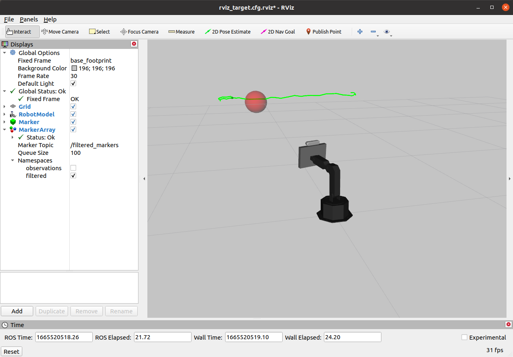

# Assignment 2 (Extra questions for CPSC-559)

The sections below for Assignment 2 are only meant to be completed/answered by students taking CPSC-559. Students in CPSC-459 are welcome to try to solve the problems/tasks below and even come to office hours to discuss them. However, their answers to the questions in Parts IV and V of the Assignment 2 will not be considered during grading.

## Part IV. Addressing Delayed Tracking

Once you have implemented your Kalman Filter (in Part III of the assignment), you should
be able to visualize the robot following the target with the `follow_target.launch` script in the `shutter_kf` package. Unfortunately, though, if you speed up the motion of the target, you'll see the robot tracking it with a significant delay. For instance, if you run:

```bash
$ roslaunch shutter_kf follow_target.launch add_noise:=true path_type:=circular fast_target:=true
```

Then, you would see the green PoseStamped visualization lagging behind the true target, thus making the robot
look a bit a way from the red ball, as shown below:



### Questions / Tasks

- **IV-1.** Copy the `kalman_filter.py` script into a new `future_kalman_filter.py` script. Then, modify the new `future_kalman_filter.py`
script so that it forecasts into the future the position of the target so that the robot is not so behind when tracking it. The forecasted
position should still be output as a PoseStamped message throug the `/filtered_target` topic so that you can evaluate whether the robot
is better tracking the target with the `follow_target.launch` script.


## Part V. Non-Parametric Filtering

In this part of the assignment, you should think about how to implement a particle filter for object tracking (Part III & IV). No code needs to be implemented, but answers must be included in your final report.

### Questions / Tasks

- **V-1.** Would a particle filter be advantageous over a Kalman Filter for tracking the red ball used throughout this assignment? Explain in your report why or why not you expect a particle filter to be advantageous.

- **V-2.** If you were to implement a particle filter for tracking your object in Part IV, can you use the same transition (motion) model as in your Kalman Filter implementation? Do you need to modify it in any way? Explain in your report.

- **V-3.** If you were to implement a particle filter for tracking your object in Part IV, how would you compute the weights for the particles?
