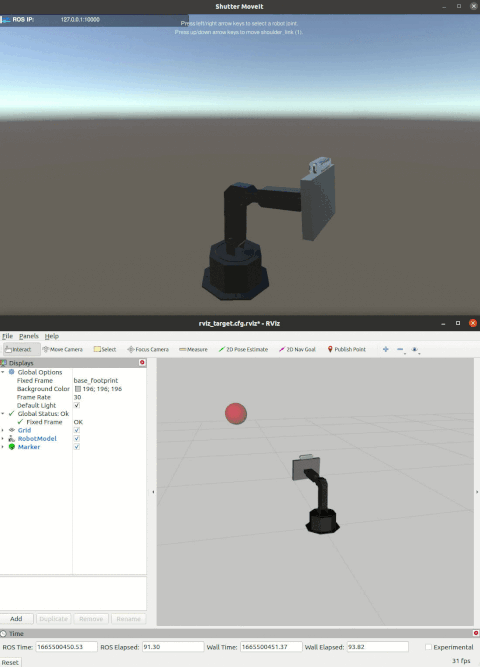
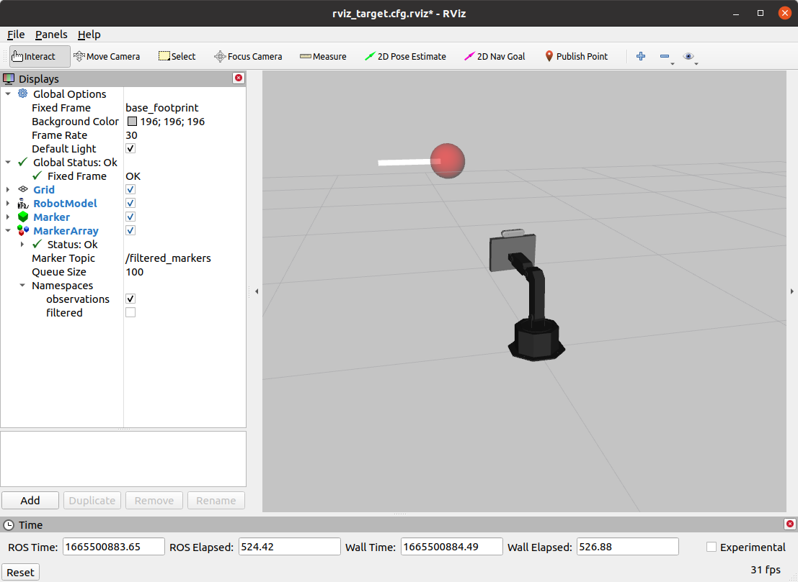
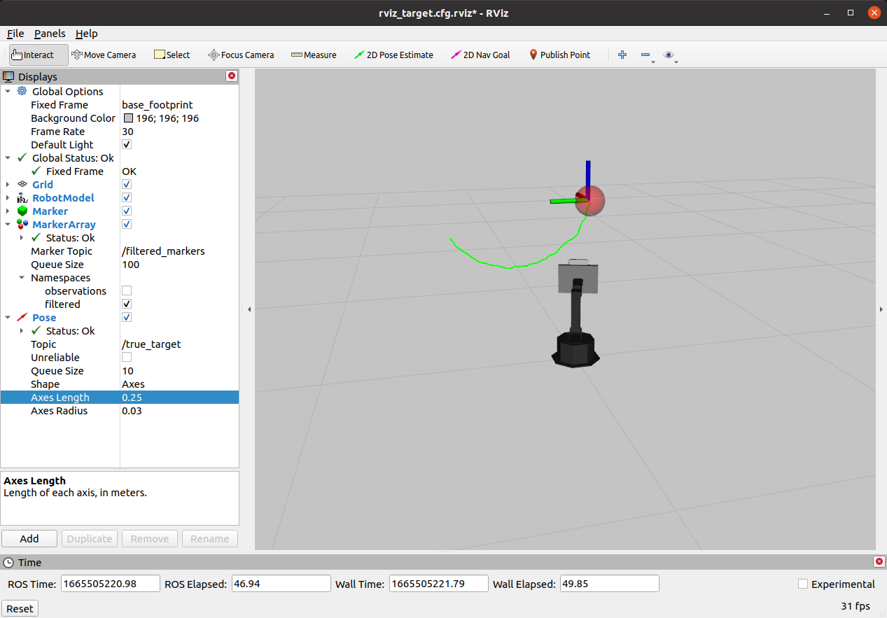

# Assignment 2

This is the second assignment for Yale's CPSC-459/559 Building Interactive Machines course.

## Table of Contents

* [Introduction](#introduction)
    * [System Requirements](#system-requirements)
    * [Background Knowledge](#background-knowledge)
    * [Preliminaries](#preliminaries)
       * [Training on Google Colaboratory](#training-on-google-colaboratory)
       * [Training on Google Cloud](#training-on-google-cloud)
    * [Deliverables](#deliverables)
    * [Evaluation](#evaluation)
    * [Further Reading](#further-reading)
* [Setup](#setup)
* [Part I. Approximating a Non-Linear Function](#part-i-approximating-a-non-linear-function)
    * [Questions/Tasks](#questionstasks)
* [Part II. Building a Face Classifier](#part-ii-building-a-face-classifier)
    * [Questions / Tasks](#questions--tasks-1)
* [Part III. Imitation Learning (2 extra points)](#part-iii-imitation-learning-2-extra-points)
     * [Questions / Tasks](#questions--tasks-1)


## Introduction 
This assignment will provide you practical experience with deep learning. In particular, you'll become
familiar with [TensorFlow's Keras API](https://www.tensorflow.org/api_docs/python/tf/keras).


#### System Requirements
This assignment should be completed using Python 3.6–3.9 in Ubuntu 20.04. For training neural networks,
we recommend that you use cloud services if your don't have access to a local GPU. For the last part of the assignment, 
you should have access to a computer with `ROS Noetic`.

You should also have `git` and `pip3` installed in the machine that you are using to work on your assignment.
You will use git to save your work to your [Github](http://www.github.com) repository. The pip3 tool will be used to install
Python dependencies, and can be installed in Unbuntu 20.04 as in [this guide](https://linuxize.com/post/how-to-install-pip-on-ubuntu-20.04/). More details on installing pip3 are provided later in this document.

#### Background Knowledge

This assignment assumes that you have already completed the prior assignments and, thus, you
 have experience with Linux shells 
(e.g., [bash](https://www.gnu.org/software/bash/)), and [git](https://git-scm.com/). You are also expected to be familiar with the [numpy Python library](http://www.numpy.org/) for linear algebra. 
If you are not, please check [this tutorial](https://docs.scipy.org/doc/numpy/user/quickstart.html) before starting the assignment.

#### Preliminaries
You will be training supervised learning models, especially Neural Networks, for this assignment. 
It is possible to complete the training of models using your local CPU, but it might be faster at times to train on the cloud and
using hardware acceleration (e.g., a dedicated GPU).

> Whether or not you use the cloud to train your neural networks, the deliverables are the same.
You should submit code in your private Github repository. You should also submit a report to Gradescope
and provide model parameter files through Google Drive.

##### Training on Google Colaboratory
One option to train a network on the cloud is to use [Google Colaboratory](https://colab.research.google.com).
Google Colaboratory (or Colab) is a **free** research tool for machine learning education and research. It's a 
[Jupyter notebook](http://jupyter.org/) environment that requires no setup to use. For more information
on using Google Colab such as usage limits, read the official [F.A.Q](https://research.google.com/colaboratory/faq.html).

A `quick tutorial` on using Google Colab for this assignment is provided in the 
[Train_Google_Colab.md](Train_Google_Colab.md) file.

##### Training on Google Cloud
Another option is to use [Google Cloud](https://cloud.google.com). This option is not free,
but you can customize virtual machines with as many resources as you need. Use your 
credits judiciously. 

A `quick tutorial` on using Google Cloud for this assignment is provided in the
[Train_Google_Cloud_Engine.md](Train_Google_Cloud_Engine.md) file.


#### Deliverables

- **Report:** You are expected to submit a pdf to Gradescope with answers to the questions/tasks at 
the end of each part of the assignment. This report should also have any information needed 
to understand and/or run your code, as well as the specific commit SHA of the version of the code
that you would like to be evaluated on. The report is a fillable PDF which is available [here](https://drive.google.com/file/d/1S7vY2YioP11L5BmuSDIt2hQcZV6Ex21a/view?usp=sharing).

- **Model weights and input normalization parameters:** You should upload trained models and parameters
to Google Drive and share them with anybody who has access to the links.

- **Code:** Finally, you are expected to push code for this assignment to your 
[Github](http://www.github.com) repository and submit it to Gradescope.

#### Evaluation

You assignment will be evaluated based on the content of your report and your code.

- Report (52 pts for CPSC 459 / 72 pts for CPSC 559)
    * Part I (32 pts): I-1 (8 pts) + I-3 (8 pts) + I-4 (10 pts) + I-5 (6 pts)
    * Part III (20 pts): IV-1 (5 pts) + IV-2 (5 pts) + IV-3 (5 pts) + IV-4 (5 pts)
    * Part V (20 pts for CPSC-559 only): IV-1 (7 pts) + IV-2 (5 pts) + IV-3 (8 pts)
- Code (128 pts for CPSC 459 / 148 pts for CPSC 559)
    * Part I (20 pts): I-1 (4 pts) + I-2 (6 pts) + I-3 (10 pts)
    * Part II (54 pts): III-1 (34 pts) + III-2 (20 pts)
    * Part III (54 pts): IV-5 (8 pts) + IV-6 (8 pts) + IV-7 (6 pts) + IV-8 (6 pts) + IV-9 (4 pts) + IV-10 (6 pts) + IV-11 (16 pts) 
    * Part IV (20 pts for CPSC-559 only): IV-1 (20 pts)

Students taking CPSC-459 will be evaluated over 180 pts. Those taking CPSC-559, will be evaluated over 220 pts.

**Note on Part II of the assignment:** Part II provides extra credit for those at the top of the leaderboard in Gradescope.
The extra credit (2 pts) will be counted for the final course grade 
(over 100 pts for this assignment). 

#### Further Reading

Below are some example Neural Networks to give you a starting point for implementing your own:
- [SqueezeNet](https://arxiv.org/abs/1602.07360) - A small network for image classification
- [Tiny Darknet](https://pjreddie.com/darknet/tiny-darknet/) - An even smaller network for image classification

## Setup
Before you start implementing or answering questions for this assignment, please
check that [pip3](https://pip.pypa.io/en/stable/) is installed in your machine:

```bash
$ pip3 --version
```

If it's not installed and you are using Ubuntu, then install it with:

```bash
$ sudo apt update
$ sudo apt install python3-pip
```

Then, update your repository to pull the latest changes from the assignments repository,
install Python dependencies, and update the shutter-ros repository:

```bash
# update your repository with the latest version of the assignment
$ cd <path-to-your-repository-in-your-workspace>
$ git pull upstream master

# install Assignment-2 Python dependencies
$ cd assignment-2
$ ./install_python_deps.sh

# update the shutter-ros repository 
$ roscd shutter_bringup
$ git pull

# finally, re-build your catkin workspace 
$ cd <path-to-your-catkin-workspace-root-directory>
$ catkin_make -DCMAKE_BUILD_TYPE=Release
```

The above `install_python_deps.sh` script will install several Python packages
that are required for this assignment, including TensorFlow v. 2.10.0. 

You can verify your TensorFlow installation as follows:

```bash
$ python3 -c "import tensorflow as tf; print(tf.__version__)"
(...)
2.10.0
```

**NOTE:** If your machine has a GPU with CUDA Compute Capability 3.5 or higher and 
you have [CUDA 11.2](https://developer.nvidia.com/cuda-11.2-download-archive) plus 
[cuDNN 8.1.0](https://developer.nvidia.com/cudnn) installed in your system, then you should install:

```bash
pip3 install --user tensorflow==2.10.0
```

to take advantage of hardware acceleration. You can test that your GPU is visible in TensorFlow
by running the following commands on a Python shell:

```python
>> import tensorflow as tf
>> tf.test.is_gpu_available()
```

The function should return True if TensorFlow can access your GPU. If the function
returns False, check the errors that are printed in the shell. Common errors include
not having Cuda 11.2 installed in the system but a different version, not having CuDNN
installed for Cuda 11.2, and not having CUDA system variables setup in your environment.
For instance, important CUDA system variables include:

```bash
export PATH=$PATH:/usr/local/cuda-11.2/bin
export CUDADIR=/usr/local/cuda-11.2
export LD_LIBRARY_PATH=$LD_LIBRARY_PATH:/usr/local/cuda-11.2/lib64
```

See the [TensorFlow GPU support page](https://www.tensorflow.org/install/gpu) 
for more information. 


## Part I. Approximating a Non-Linear Function

Read the [Primer on Universal Function Approximation with Deep Learning](https://cartesianfaith.com/2016/09/23/a-primer-on-universal-function-approximation-with-deep-learning-in-torch-and-r/) 
by Brian Yung Rowe. 

Once you've read the primer, you should complete the tasks below to approximate the 
[monkey saddle surface](https://en.wikipedia.org/wiki/Monkey_saddle) defined by the equation .
<!-- $`z = x^3 - 3xy^2`$ --> 
Your code should leverage [TensorFlow's Keras API](https://www.tensorflow.org/guide/keras).

To get you started, this assignment provides two files within the 
`assignment-2/function_approximation` directory:

- *train_and_test_saddle_function.py:* main file that you will complete in this part of the assignment.
- *saddle_function_utils:* code to generate data and help you visualize results.

If you run the train_and_test_saddle_function.py script (which is incomplete at this point)
with the `visualize_training_data` option, you should be able to visualize the data that the
script generates for you and example predictions with a linear neural network model implemented with 
[TensorFlow's Keras API](https://www.tensorflow.org/versions/r2.0/api_docs/python/tf/keras):

```bash
$ cd assignment-2/function_approximation
$ ./train_and_test_saddle_function.py --visualize_training_data
```

When you run the script, a [matplotlib](https://matplotlib.org/) plot of the data should appear, 
as in the figure below:


And, once the linear model is trained for a number of epochs with the 
[Adam optimizer](https://www.tensorflow.org/api_docs/python/tf/keras/optimizers/Adam), the script would show a figure like the one below:


To see all the options that the train script already provides, run it as:

```bash
$ ./train_and_test_saddle_function.py --help
usage: train_and_test_saddle_function.py [-h] [--n N]
                                         [--batch_size BATCH_SIZE]
                                         [--epochs EPOCHS] [--lr LR]
                                         [--visualize_training_data]
                                         [--build_fn BUILD_FN]

optional arguments:
  -h, --help            show this help message and exit
  --n N                 total number of examples (including training, testing,
                        and validation)
  --batch_size BATCH_SIZE
                        batch size used for training
  --epochs EPOCHS       number of epochs for training
  --lr LR               learning rate for training
  --visualize_training_data
                        visualize training data
  --build_fn BUILD_FN   model to train (e.g., 'linear')
```

The optional parameters `lr`, `epochs`, and `batch_size` correspond to the learning rate,
number of epochs, and bath size that are used at training time.

Read the code in the training script to familiarize yourself with its functionality. Optionally, you can also 
watch [Nathan's video](https://yale.hosted.panopto.com/Panopto/Pages/Viewer.aspx?id=c6bbc9b8-1619-48e6-991d-af2a00efdcd9), where he walks you through the code in a [Google Colab notebook](https://colab.research.google.com/drive/1XXUKUXh1kMRgg6Vd6VkPZJIbMe0s11w-?usp=sharing) so that you understand how to work with Keras within the training script. Note that you do not have to work with this notebook for your assignment. In fact, the notebook is missing certain lines of code that Nathan completes in his video. This is so that he can highlight key functionality already included in the [assignment-2/function_approximation/train_and_test_saddle_function.py](function_approximation/train_and_test_saddle_function.py) script that is part of this assignment.

### Questions/Tasks

- **I-1.** Add callbacks to the [Keras model's fit function](https://www.tensorflow.org/versions/r2.0/api_docs/python/tf/keras/Model#fit) 
in the `train_model()` method of the train_and_test_saddle_function.py script:

    ```python
     # tensorboard callback
     logs_dir = 'logs/log_{}'.format(datetime.datetime.now().strftime("%m-%d-%Y-%H-%M"))
     tbCallBack = tf.keras.callbacks.TensorBoard(log_dir=logs_dir, write_graph=True)

     # save checkpoint callback
     checkpointCallBack = tf.keras.callbacks.ModelCheckpoint(os.path.join(logs_dir,'best_monkey_weights.h5'),
                                                            monitor='mae',
                                                            verbose=0,
                                                            save_best_only=True,
                                                            save_weights_only=False,
                                                            mode='auto',
                                                            save_freq=1)

     # do training for the specified number of epochs and with the given batch size
     model.fit(norm_train_input, train_target, epochs=epochs, batch_size=batch_size,
              validation_data=(norm_val_input, val_target),
              callbacks=[tbCallBack, checkpointCallBack]) # add this extra parameter to the fit function
    ```

    The callbacks perform the following operations during the training loop:
    
    - **tf.keras.callbacks.TensorBoard:** The [TensorBoard](https://www.tensorflow.org/guide/summaries_and_tensorboard) 
    callback writes [TensorBoard](https://www.tensorflow.org/tensorboard) logs to a given directory.
    - **tf.keras.callbacks.ModelCheckpoint:** Callback that saves the model after every epoch (see
    more information [here](https://www.tensorflow.org/api_docs/python/tf/keras/callbacks/ModelCheckpoint)).
    Because we set "save_best_only = True", the callback would only save the model if the
    validation loss is smaller than the prior best validation loss.<br/><br/>
    
    Run the `train_and_test_saddle_function.py` script again to check that it is indeed saving model weights to a logs folder.
    Also, check that you can visualize your training losses in TensorBoard by running it from another shell:

    ```bash
    $ tensorboard --logdir <path_to_logs>
    ```

    Then, go to the URL that the script provides (e.g., http://localhost:6006) in your favorite
    browser. The `SCALARS` tab of the TensorBoard interface should then show various training curves
    (e.g., epoch_loss for the loss after every epoch in the training and validation sets). The `GRAPHS` tab of the TensorBoard interface should show a 
    [computation graph](https://www.tensorflow.org/guide/graph_viz) for your simple neural network model.
    
    Make a screenshot of your computation graph and include it in your project report.
    
    > NOTE: In general, we recommend that you use TensorBoard to check your models' computation
    graphs and training/validation performance for all of the other tasks in this assignment. 
    This 30min [TensorBoard tutorial](https://www.youtube.com/watch?v=eBbEDRsCmv4)
    provides good examples on how the interface can help you debug many issues!
    
- **I-2.** Modify the train_and_test_saddle_function.py script so that you can load a `pre-trained model` 
and train its weights further (e.g., to resume training or for fine-tuning on a new task).

    a. Add a "load_model" argument to the argument parser at the end of the script:
        
    ```python
    parser = argparse.ArgumentParser()
    ... # other arguments
    parser.add_argument("--load_model", help="path to the model",
                        type=str, default="")
    ```
        
    b. Add two lines of code after the build_fn variable is set at the end of the script to
    replace the value of build_fn with [TensorFlow's Keras load_model() function](https://www.tensorflow.org/api_docs/python/tf/keras/models/load_model):
    
    ```python
    ... # Set ArgumentParser arguments()
    
    # define the model function that we will use to assemble the Neural Network
    if args.build_fn == "linear":
    ...
        
    # ---- lines to be added ----
    # load model (and thus, ignore prior build function)
    if len(args.load_model) > 0:
        build_fn = lambda x: tf.keras.models.load_model(args.load_model, compile=False)
    # ---- end of lines to be added ----
        
    # run the main function
    main(args.n, args.epochs, args.lr, args.visualize_training_data, build_fn=build_fn)
    sys.exit(0)
    ```
        
    > Note that the load_model() function above is passed the argument `compile=False`.
    This means that the model should not be compiled after loading, because the train_model() function
    does this already.
        
    c. Test your code. Your script should now be able to load a model from a file and continue training
    its weights thereafter:
    
    ```bash
    $ ./train_and_test_saddle_function.py --load_model <path_to_model_h5_file> [--lr 1e-2] [--epochs 500] [--batch_size 16]
    ```
    
    The model that you trained before for task I-1 should be stored as `best_monkey_weights.h5`
    within the folder corresponding to your training session in `assignments-2/function_approximation/logs`.
    You can pass this model as argument to your train_and_test_saddle_function.py to test the new
    functionality that you just implemented.
    
- **I-3.** Complete the function called `build_nonlinear_model()` in the `train_and_test_saddle_function.py` 
script. This function should have as argument the number of input features for the data and should
return a [Keras model](https://www.tensorflow.org/api_docs/python/tf/keras/models/Model), similar
to the `build_linear_model()` function that you implemented before. The difference between these functions, though, 
is that build_nonlinear_model() should implement a more complex neural network capable of approximating the monkey saddle surface
with an **average L2 error of 150 or less on the test set**. Note that this error is printed by the `train_and_test_saddle_function.py`
script when it finishes running.

   The `build_nonlinear_model()` function looks as follows in the `train_and_test_saddle_function.py` script:

    ```python
    def build_nonlinear_model(num_inputs):
    """
    Build nonlinear NN model with Keras
    :param num_inputs: number of input features for the model
    :return: Keras model
    """
    ... # complete
    ```
    
    Once you've implemented the function, edit the last lines of the `train_and_test_saddle_function.py` 
    script to be able to change the model that is trained through the command line:
    
    ```python
    # define the model function that we will use to assemble the Neural Network
    if args.build_fn == "linear":
        build_fn = build_linear_model # function that builds linear model
    elif args.build_fn == "nonlinear":
        build_fn = build_nonlinear_model # function that builds non-linear model
    else:
        print "Invalid build function name {}".format(args.build_fn)
        sys.exit(1)
    ```
    
    You should then be able to train and test your model as:
    ```bash
    $ ./train_and_test_saddle_function.py --build_fn nonlinear [--lr 1e-1] [--epochs 10] [--batch_size 16]
    ```
    
    Change your nonlinear model, the learning rate, and number of epochs that you are training for
    until you achieve an average test error of 150 or less. Afterwards, take a new screenshot of the plot
    that you get after training. This plot should be similar to [docs/fit-linear.png](docs/fit-linear.png)
    but show the result for your new nonlinear model. In summary, include in your report:
     
    - The screenshot of the plot with test results after training;
    - what average L2 error did you get on the test set this time;
    - a description of the neural network model that you used to approximate the monkey saddle surface; and
    - whatever parameters you used for training it (e.g., batch size, learning rate, and number of epochs).<br/><br/>
    
- **I-4.** Train your nonlinear neural network such that it `overfits` on the training data. 

    After training, include a picture
    in your report of the plots from TensorBoard corresponding to the `mean absolute error` (mae) on the training and validation
    sets. Explain how you concluded that your model overfit in the report.
    
- **I-5.** What happens with the loss per epoch on the training set if you train with a batch size of 1?
Explain why does the loss per epoch graph look different than with a bigger batch size (e.g., than with a batch size of 100).

## Part II. Imitation Learning (2 potential extra points)

In this last part of the assignment, you will gain practical experience with Behavioral Cloning. That is, you will use
supervised learning to estimate a motion policy for Shutter.

Your expert -- which you aim to learn to imitate -- will be the `expert_opt.py` node within the 
`shutter_behavior_cloning/src` directory. This expert uses optimization to align the face of the robot towards a target
by moving two of its joints: joint_1, and joint_3. In practice, this type of behavior could be 
useful for the robot to convey attention towards a moving person or object in a real scenario.

To make it easy for you to run the expert and see it in action, this assignment provides you the `collect_data.launch` 
 file. For example, if you run it as:

```bash
$ roslaunch shutter_behavior_cloning collect_data.launch
```

Then, you should see the robot in RViz following the blue targets as below:


The above launch file can also be used to generate data for behavioral cloning:

```bash
$ roslaunch shutter_behavior_cloning collect_data.launch save_state_actions:=True
```

As the launch script is running, you can check that example `state`-`action` pairs are being written
  to `shutter_behavior_cloning/data/state_action.txt`. For example, you can check this with:

```
$ tail -f state_action.txt
# data from 17/10/2021 23:00:05
base_footprint  1.1781  -0.1099 1.3627  0.0000  0.0000  -0.1202 -0.6751
base_footprint  1.9321  -2.6038 0.6671  -0.1202 -0.6751 -0.8220 0.5598
base_footprint  2.8652  -0.8011 2.2853  -0.9423 -0.1153 0.6589  -0.4528
base_footprint  2.3123  1.8743  2.6313  -0.2833 -0.5681 0.9538  -0.0859
(...)
```

The `state_action.txt` file contains comment lines that start with "#". Non-comment lines have 8 fields:
1. frame_id for the target's position
2. the target's x coordinate
3. the target's y coordinate
4. the target's z coordinate
5. the robot's current joint_1 
6. the robot's current joint_3
7. the next joint_1 that the robot should have to point towards the target
8. the next joint_3 that the robot should have to point towards the target

Thus, the state representation for this imitation learning problem is 5-dimensional. 
It corresponds to the target's position (X,Y,Z) and the current position for the robot's joint_1 and joint_3. 
The output action is 2-dimensional. It corresponds to the new position for the robot's joints.

### Questions / Tasks

- **II-1.** Generate data for behavioral cloning as explained in the prior section, and implement a script to learn
an imitation policy from this data using the TensorFlow Keras API. The script should be called `learn_policy.py` and 
be placed within the `assignment-2/shutter_behavior_cloining/scripts` directory. 

    The script should:
     
    1. Take as input the path to your training data:  
       ```bash
       $ python learn_policy.py <path_to_training_data>
       ```
       
    2. Load up the data and use it to train a neural network model that predicts the new joint positions for the robot 
    (joint_1, and joint_3). For your convenience, this assignment provides you the `load_data()` function 
    within the `assignment-2/shutter_behavior_cloning/scripts/train_utils.py` script to load up the `state_action.txt`
    data.
    
    3. Save the model's weights to disk (as well as any feature normalization parameters if need be). The Keras model
    should be saved to disk in HDF5 format using the [Keras model.save() function](https://www.tensorflow.org/versions/r2.6/api_docs/python/tf/keras/Model#save).
    The feature normalization parameters can be saved to disk in whatever format you like, so long as they are all saved
    into a single file.
    
    Once you have trained your model, upload your saved files to Google Drive and make them accessible to "Anyone with 
    the link". Then, add this link to the top of the `assignment-2/shutter_behavior_cloning/scripts/train_utils.py` file
    and test that they can be automatically downloaded using the `download_model_files()` function inside that same 
    Python file. Remember that if Google gives you a link like 
    `https://drive.google.com/file/d/<file_id>/view?usp=sharing`, then you should add 
    `https://drive.google.com/uc?id=<file_id>` to the script for the evaluation with Gradescope to run successfully.
    
- **II-2.** Complete the `assignment-2/shutter_behavior_cloining/scripts/run_policy.py` script so that it loads up 
your model and computes new poses for Shutter to follow the target. More specifically, update lines 26-28 in the script
to load up your model from disk using the model file path and normalization params provided to the node via:
    ```python
    self.model_file = rospy.get_param("~model")              # required path to model file
    self.normp_file = rospy.get_param("~norm_params", "")    # optional path to normalization parameters (empty str means no norm params)
    ```
    Also, update the `compute_joints_position()` function in line 63 to make a prediction for 
    the robot's joint position such that the `target_callback()` function can command the robot to move appropriately relative to the observed target.

    **NOTE 1:** You can test your model with the `test_policy.launch` file within 
    `assignment-2/shutter_behavior_cloning/test`. For example:
    ```bash
    rostest shutter_behavior_cloning test_policy.launch model:=<full_path_to_model_hdf5> [normp:=<full_path_to_normalization_file>] run_rviz:=True
    ```
    The test will output the `~/.ros/test_policy_output.txt` file with: trial number, the target's x,y,z coordinates,
    the difference (in radians) between the predicted joint_1 and joint_3 positions and the expert's output, and
    and acceptable boolean value indicating if both differences are less than 0.00872665 radians (0.5 degrees).
  
    **NOTE 2:** When you submit your code to Gradescope, your model files will be downloaded from Google Drive automatically
    and tested on the virtual robot on 100 trials. The number of trials for which you get an acceptable output (as 
    defined above) will set 50% of your grade for this part of the assignment. The other 50% will be based on
    whether your training script runs as indicated in Part III-1 and 
    your model can be downloaded successfully from Google Drive for testing.
    
    **NOTE 3:** The student(s) with the minimum average error: `avg(diff_j1 + diff_j3)` up to 3 point precision
    will receive 2 extra points in their final course grade. Multiple submissions to this assignment are allowed
    in Gradescope. There are two parallel leaderboards: one for 459, and one for 559. Thus, at least 2 students are 
    expected to get extra points for this part of the assignment (one enrolled in 459 and one in 559).
    

## Part III. Real-Time Filtering
You will now implement a linear Kalman filter to track the moving target in front of the robot. Please read Sections 3.2.1 and 3.2.2 from Chapter 3 of the [Probabilistic Robotics book](http://www.probabilistic-robotics.org/) before starting with 
this assigment. The Chapter is available in Canvas (under the Files section). Chapters 3.2.1 and 3.2.2 will remind you of how Kalman filters work.

For this assignment, the `filter state` 
<!--$`\bold{x} \in \mathbb{R}^9`$--> should contain <!--$`\bold{x} = [p_x\ p_y\ p_z\ v_x\ v_y\ v_z\ a_x\ a_y\ a_z]^T`$-->, 
where <!--$`\mathbf{p} = [p_x\ p_y\ p_z]^T`$--> corresponds to the estimated position of the target in an image, 
 <!--$`\mathbf{v} = [v_x\ v_y\ v_z]^T`$--> is its estimated velocity, and <!--$`\mathbf{a} = [a_x\ a_y\ a_z]^T`$--> is its estimated acceleration.

The `transition model` of the filter should include additive gaussian noise and 
follow the [equations of motion](https://en.wikipedia.org/wiki/Equations_of_motion):

- ^2)<!--$`\bold{p}_{t+1} = \bold{p}_t + \bold{v}_t \Delta t + \frac{1}{2} \bold{a} (\Delta t)^2`$-->
- <!--$`\bold{v}_{t+1} = \bold{v}_t + \bold{a}_t \Delta t`$-->
- <!--$`\bold{a}_{t+1} = \bold{a}_t`$-->

where  <!--$`\Delta t`$--> is the elapsed time between updates.

The `measurement model` of the filter should correct for the predicted state based on
the observed position of the moving target. This observation will be generated by the `shutter_kf/scripts/generate_continuous_target.py`
node for this part of the assignment.

You should implement your Kalman filter 
within the `kalman_filter.py` script that is inside of the [shutter_kf/scripts](https://github.com/Yale-BIM/f22-assignments/tree/master/assignment-2/shutter_kf/scripts) 
directory, as indicated in the tasks below. The `kalman_filter.py` script already provides you with
the main logic for a filtering node, and will help you debug your filter visually using RViz. 

### Questions / Tasks

- **III-1.** Please write down the mathematical equation for the filter's linear transition model, including
Gaussian noise, in your report. Note that because you are not in control of the target's motion, but tracking will be
happening only based on the observed target position, your filter's transition model should have no control  <!--$`\bold{u}`$--> component.

- **III-2.** Please write down the mathematical equation for the filter's measurement model, including Gaussian
noise, in your report.

- **III-3.** Please write down the mathematical equation that defines the Kalman gain in your report.

- **III-4.** What happens with the values in the Kalman gain if the covariance <!--$`Q`$--> for the measurement noise 
grows?

- **III-5.** Complete the `KF_predict_step()` function at the top of the
[kalman_filter.py](https://github.com/Yale-BIM/f22-assignments/blob/master/assignment-2/shutter_kf/scripts/kalman_filter.py) script such that it predicts a new belief for the state (encoded by its mean and covariance) based
on the prior belief and the transition model of the filter.

- **III-6.** Complete the `KF_measurement_update_step()` function in the [kalman_filter.py](https://github.com/Yale-BIM/f22-assignments/blob/master/assignment-2/shutter_kf/scripts/kalman_filter.py) script such that
it corrects the belief of the state of the filter based on the latest observation and the filter's
measurement model.

- **III-7.** Implement the `assemble_A_matrix()` and `assemble_C_matrix()` methods within the `KalmanFilterNode`
class of the [kalman_filter.py](https://github.com/Yale-BIM/f22-assignments/blob/master/assignment-2/shutter_kf/scripts/kalman_filter.py) script. The methods should set the A and C
parameters of the transition and measurement model of the filter used by the `KalmanFilterNode`. Use [numpy
arrays](https://docs.scipy.org/doc/numpy-1.15.1/reference/generated/numpy.array.html) to represent the A and C matrices.

    > NOTE: You do not have to implement the logic that passes the A and C parameters to the filter. This is
    already done for you in the main loop of the KalmanFilterNode class.
    
- **III-8.** Implement the `initialize_process_covariance()` and `initialize_measurement_covariance()` methods
within the `KalmanFilterNode` class of the [kalman_filter.py](https://github.com/Yale-BIM/f22-assignments/blob/master/assignment-2/shutter_kf/scripts/kalman_filter.py) script. These methods should set some fixed value
for the Q and R covariances
for the noise of the transition model and measurement model, respectively. Don't worry too much about the
exact values that you set for the noise now, as you will have to tune these values later in the assignment.

- **III-9.** Implement the `assemble_observation_vector()` function within the `KalmanFilterNode` class of the
[kalman_filter.py](https://github.com/Yale-BIM/f22-assignments/blob/master/assignment-2/shutter_kf/scripts/kalman_filter.py) script. This function should return a vector (numpy array) with the observed position for the
target. 
 
    > To make this part of the assigment easy, note that the `assemble_observation_vector()` function has
    an Observation message argument. This argument provides the latest observed position of the target as received
    through the `/target` topic in the `KalmanFilterNode`.

- **III-10.** Implement the `initialize_mu_and_sigma()` method within the `KalmanFilterNode` class of the
[kalman_filter.py](https://github.com/Yale-BIM/f22-assignments/blob/master/assignment-2/shutter_kf/scripts/kalman_filter.py) script. This method should set the initial values for the filter belief based on the latest
observed target position. Again, note that this observation is passed to the `initialize_mu_and_sigma()` method
as an input argument.

- **III-11.** Once you have finished the prior tasks, run:

    ```bash
    $ roslaunch shutter_kf follow_target.launch
    ```

    You should then see the robot following the moving target
    left-to-right and right-to-left, as in the gif below.

    

    You can add a MarkerArray visualization to RViz to display
    the observations received by the robot from the moving target.
    Select the MarkerArray item in the DisplaysPanel, open the Namespaces menu, and select only "observations". Then, you should see a white moving line that is a short-history of the
    observations received by the robot.

    

    If you unselect "observations" from the MarkerArray namespaces and activate the "filtered" option, then you should be able to see a green line that corresponds to a history of tracked 
    positions for the moving target.

    Improve your filter so that it can track well the object
    when noise is added to the observation, considering
    three motion trajectories for the object: `horizontal`,
    `vertical`, `circular`. Run the code as follows:

    ```bash
    $ roslaunch shutter_kf follow_target.launch add_noise:=true path_type:=<path_type>
    ```

    where `<path_type>=[horizontal|vertical|circular]`. No matter which path_type you choose, your filter should track the target
    well (recovering the true target's position as if there was
    no noise). 

    Note that you can see what the `true` position of the target is 
    when the `add_noise` flag is true by adding a PoseStamped visualization 
    in rviz for the `/true_target` topic. Then, you should be able to see
    the (noisy) observation as a red ball, the history filtered positions 
    as a green line (using the MarkerArray visualization mentioned before),
    and the true target pose as a set of coordinate axes as follows:

    

    **How much should you tune your filter?** To help you answer this question, we have included a [test](shutter_kf_public_tests/test/test_filter_quality.py) that 
    measures the average L2 error with respect to the true position of the target. The test passes if 
    the average error is less than 0.04 meters. You can run the test as follows:

    ```bash
    $ rostest shutter_kf_public_tests test_filter_quality.launch
    ```

    It is expected that assignment submissions will pass a similar test to the one above for all motion trajectories (horizontal, vertical and circular). Note that the above launch file repeats the test up to 4 times to account for randomness in the target generation script. The code passes the test if the average error is less than 0.04 meters for at least one try.


## Parts IV and V

Parts IV and V of the assignment are only for students taking CPSC-559 (graduate version of the course). See the tasks/questions in the [ExtraQuestions-CPSC559.md](ExtraQuestions-CPSC559.md) document.

**Once you get to the end of the assignment, remember to commit your code, push to GitHub, and indicate
in your assignment report the commit SHA for the final version of your code. Your code and report should be submitted to 
Gradescope.**
