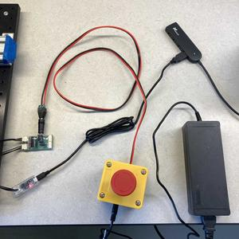

# Shutter Hardware Setup

This document describes the necessary hardware setup to run a desktop Shutter robot, as well as solutions to common setup failure cases.


## Assembly

### Power Supply, E-Stop and Servo Controller

The four servos have a separate power supply and a [U2D2 controller](https://emanual.robotis.com/docs/en/parts/interface/u2d2/).
The power supply should be routed to the servos via an e-stop button.
The U2D2 controller can be connected through a USB hub, or directly to your machine.
The assembly is pictured below:


It is best practice to enable the e-stop when not using the robot.

**Do not run the physical robot over AnyDesk or ssh!**


### Screen

The screen that is Shutter's face display has an HDMI cable and USB power cable.
The HDMI cable can be connected directly to the laptop's available HDMI-out port.
The USB power can be connected through a USB hub.

### RealSense

The RealSense has a USB cable.
A USB3.0 connection or faster is required.
The cable should be connected directly to your laptop, and not through a USB hub.
Further details are located in the [RealSense usage notes](realsense.md)


### Kinect

The Kinect has a USB cable and a power adapter with a barrel connector.
A USB3.0 connection or faster is required.
The USB cable should be connected directly to your laptop, and not through a USB hub.
The power adapter should be connected to an outlet.
Further details are located in the [Kinect usage notes](kinect.md)


## Validating Assembly

This section assumes the installation of the [shutter-ros codebase](https://gitlab.com/interactive-machines/shutter/shutter-ros) as described in the [online shutter-ros documentation](https://shutter-ros.readthedocs.io/en/latest/).

Make sure that the e-stop is disengaged (button should be raised).
Then, start the robot with roslaunch:
```
$ roslaunch shutter_bringup shutter_with_face.launch
```

The robot should slightly "jog" itself out of the resting pose, and the face should display the default (neutral) expression.

You can send a new pose to the servos with `rostopic pub`:
```
$ rostopic pub -1 /joint_group_controller/command std_msgs/Float64MultiArray "data: [0.0, -1.0, -0.8, -0.4]"
```

The expressions rendered on Shutter's face can also be set with `rostopic pub`:
```
$ rostopic pub -1 /gaze/expression_index std_msgs/String "data: happy"
```

Available expressions are enumerated in the [shutter_face documentation](https://shutter-ros.readthedocs.io/en/latest/packages/shutter_face.html#other-facial-expressions).

The RealSense and Kinect sensors can be verified separately, as detailed in their respective documents: [realsense](realsense.md) | [kinect](kinect.md)


## Common Failure Cases

### Serial Latency Timer

The USB-to-serial device has a high timer-induced delay (default of 16 ms).
The delay in milliseconds can be queried with the command:
```
$ cat /sys/bus/usb-serial/devices/ttyUSB0/latency_timer
<defaults to "16">
```

To reduce the latency, run `setserial`:
```
$ setserial /dev/ttyUSB0 low_latency
```

You can verify that the timer is reduced to a value of 1 ms by querying the latency timer again:
```
$ cat /sys/bus/usb-serial/devices/ttyUSB0/latency_timer
<should print "1">
```

To make this change applied at runtime, add the setserial command to your `.bashrc`.
For example:
```
$ echo "setserial /dev/ttyUSB0 low_latency" >> ~/.bashrc
```
Note that you will need to log out to apply the edits to `.bashrc`.

See [Working with the Servos & Using the DYNAMIXEL Protocol 2](https://gitlab.com/interactive-machines/shutter/shutter-ros/-/wikis/Working-with-the-Servos-&-Using-the-DYNAMIXEL-Protocol-2.0#getting-the-servos-to-publish-their-state-fast) for additional details.


### Screen Resolution

Shutter's face display has a native resolution of 800x480 pixels.
However, the resolution is often incorrectly set by the default X server configuration.
To set the resolution manually on login, follow the steps from [Screen Issues | shutter-ros wiki](https://gitlab.com/interactive-machines/shutter/shutter-ros/-/wikis/screen_issues#save-these-changes).
Note that you should log out for the changes to be applied.


## Troubleshooting

If any issues during setup arise, please contact the course staff via Slack.
Including a screenshot of warnings and errors from ROS, or a photograph of the hardware assembly, is recommended to facilitate troubleshooting.